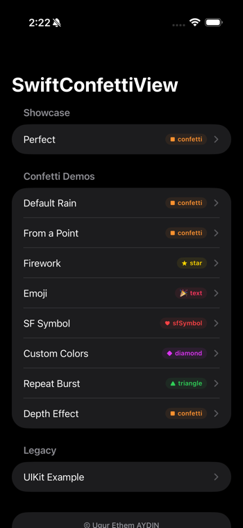

<p align="center">

</p>

# SwiftConfettiView      [](https://twitter.com/intent/tweet?text=Celebrate%20every%20moment%20in%20your%20app%20with%20SwiftConfettiView%20🎉&url=https://github.com/ugurethemaydin/SwiftConfettiView&hashtags=swift,ios,swiftui,confetti,opensource)

**Celebrate every moment in your app**


[](https://cocoapods.org/pods/SwiftConfettiView)
[](https://cocoapods.org/pods/SwiftConfettiView)
[](https://cocoapods.org/pods/SwiftConfettiView)

<table align="center">
<tr>
<td align="center"><br><b>Example App</b></td>
<td align="center"><video src="demo-perfect.mp4" width="200" autoplay loop muted playsinline></video><br><b>Perfect</b></td>
<td align="center"><video src="demo-rain.mp4" width="200" autoplay loop muted playsinline></video><br><b>Default Rain</b></td>
<td align="center"><video src="demo-point.mp4" width="200" autoplay loop muted playsinline></video><br><b>From a Point</b></td>
</tr>
<tr>
<td align="center"><video src="demo-firework.mp4" width="200" autoplay loop muted playsinline></video><br><b>Firework</b></td>
<td align="center"><video src="demo-emoji.mp4" width="200" autoplay loop muted playsinline></video><br><b>Emoji</b></td>
<td align="center"><video src="demo-sfsymbol.mp4" width="200" autoplay loop muted playsinline></video><br><b>SF Symbol</b></td>
<td align="center"><video src="demo-colors.mp4" width="200" autoplay loop muted playsinline></video><br><b>Custom Colors</b></td>
</tr>
<tr>
<td align="center"><video src="demo-repeat.mp4" width="200" autoplay loop muted playsinline></video><br><b>Repeat Burst</b></td>
<td align="center"><video src="demo.mp4" width="200" autoplay loop muted playsinline></video><br><b>Depth Effect</b></td>
<td align="center"><video src="demo-uikit.mp4" width="200" autoplay loop muted playsinline></video><br><b>UIKit</b></td>
<td></td>
</tr>
</table>

SwiftConfettiView is the easiest way to add fun, multi-colored confetti to your application and make users feel rewarded. Written in Swift, it is a subclass of UIView and is highly customizable — types, colors, intensity, presets, sound, and more.

To run the example project, clone the repo and run `pod install` from the Example directory.

## Requirements

iOS 13.0+ · Swift 5.0+

> **Upgrading from v0.1?** See the [Migration Guide](MIGRATION.md) — Xcode provides automatic Fix-it for renamed APIs.

## Installation

### Swift Package Manager

Add SwiftConfettiView to your project via Xcode:

1. File → Add Package Dependencies
2. Enter the repository URL:

```
https://github.com/ugurethemaydin/SwiftConfettiView.git
```

Or add it to your `Package.swift`:

```swift
dependencies: [
    .package(url: "https://github.com/ugurethemaydin/SwiftConfettiView.git", from: "1.0.0")
]
```

### CocoaPods

SwiftConfettiView is also available through [CocoaPods](https://cocoapods.org). To install
it, simply add the following line to your Podfile:

```swift
pod 'SwiftConfettiView'
```

And then run:

`$ pod install`

#### Manual Installation
To manually install SwiftConfettiView, simply add `SwiftConfettiView.swift` to your project.

## Usage

### Presets

Get started instantly with pre-configured templates:

| Preset | Effect |
|--------|--------|
| `.perfect` | Intense burst with depth, haptic & sound |
| `.firework` | 360° star explosion from center |
| `.rain` | Gentle continuous confetti rain |

**UIKit:**

```swift
confettiView.applyPreset(.perfect)
confettiView.startConfetti()
```

**SwiftUI:**

```swift
ConfettiView(preset: .perfect, isActive: $showConfetti)
```

Override specific settings after applying a preset:

```swift
// UIKit
confettiView.applyPreset(.perfect)
confettiView.playSound = false

// SwiftUI
ConfettiView(preset: .perfect, isActive: $isActive, playSound: false)
```

### UIKit

Creating a SwiftConfettiView is the same as creating a UIView:

```swift
let confettiView = SwiftConfettiView(frame: self.view.bounds)
```

Don't forget to add the subview!

```swift
self.view.addSubview(confettiView)
```

### SwiftUI

```swift
import SwiftConfettiView

struct ContentView: View {
    @State private var showConfetti = false

    var body: some View {
        ZStack {
            ConfettiView(type: .confetti, isActive: $showConfetti)

            Button("Celebrate!") {
                showConfetti.toggle()
            }
        }
    }
}
```

### Types

Pick one of the preconfigured types of confetti with the `.type` property, or create your own by providing a custom image. This property defaults to the `.confetti` type.

| Type | Code |
|------|------|
| `.confetti` | `confettiView.type = .confetti` |
| `.triangle` | `confettiView.type = .triangle` |
| `.star` | `confettiView.type = .star` |
| `.diamond` | `confettiView.type = .diamond` |
| `.image` | `confettiView.type = .image(UIImage(named: "smiley"))` |
| `.text` | `confettiView.type = .text("🎉")` |
| `.sfSymbol` | `confettiView.type = .sfSymbol("star.fill")` |

### Colors

Set the colors of the confetti with the `.colors` property. This property has a default value of multiple colors.

``` swift
confettiView.colors = [.red, .green, .blue]
```

### Intensity

The intensity refers to how many particles are generated and how quickly they fall. Set the intensity of the confetti with the `.intensity` property by passing in a value between 0 and 1. The default intensity is 0.5.

``` swift
confettiView.intensity = 0.75
```

### Density

Control how many particles fill the screen. Higher values = more particles. Default is `1.0`.

```swift
confettiView.density = 2.0  // double the particles
```

### Emission Origin

By default, confetti rains from the top edge. Set `emitterOrigin` to emit from a specific point:

```swift
confettiView.emitterOrigin = CGPoint(x: 200, y: 300)
```

### Emission Angle & Spread

Control the direction and cone width of particle emission (in radians):

```swift
confettiView.emissionAngle = 3 * .pi / 2  // upward
confettiView.spread = .pi / 4              // narrow cone
```

For a 360-degree firework effect:

```swift
confettiView.spread = 2 * .pi
```

### Burst Mode

For a one-shot burst instead of continuous rain, set `burstCount`:

```swift
confettiView.burstCount = 100
```

The confetti stops automatically after emitting the specified number of particles.

### Haptic Feedback

Trigger haptic feedback when confetti starts:

```swift
confettiView.hapticFeedback = true
```

### Sound

Play a built-in celebratory sound when confetti starts:

```swift
confettiView.playSound = true
```

Use a custom sound file:

```swift
confettiView.customSoundURL = Bundle.main.url(forResource: "victory", withExtension: "mp3")
```

### Depth Effect

Enable dual-layer parallax for a 3D depth illusion. A background layer (smaller, slower, dimmer particles) is added behind the main foreground layer:

```swift
confettiView.addDepth = true
```

### Fade Out

By default, stopping confetti fades out smoothly. Disable for an abrupt stop:

```swift
confettiView.fadeOut = false  // default is true
```

### Callback

Get notified when confetti stops:

```swift
confettiView.onStop = {
    print("Confetti finished!")
}
```

### Starting / Stopping / Status

```swift
confettiView.startConfetti()  // start
confettiView.stopConfetti()   // stop
confettiView.isActive         // true while confetti is on screen
```

### SwiftUI — Advanced Examples

**Point emission (burst from a button):**

```swift
ConfettiView(
    isActive: $isActive,
    emitterOrigin: buttonCenter,
    emissionAngle: 3 * .pi / 2,
    burstCount: 80
)
```

**Firework effect (360-degree burst):**

```swift
ConfettiView(
    type: .star,
    isActive: $isActive,
    emitterOrigin: CGPoint(x: 200, y: 400),
    spread: 2 * .pi,
    burstCount: 100,
    hapticFeedback: true
)
```

**Emoji confetti:**

```swift
ConfettiView(
    type: .text("🎉"),
    isActive: $showConfetti
)
```

**Depth effect (parallax rain):**

```swift
ConfettiView(
    isActive: $showConfetti,
    addDepth: true
)
```

**SF Symbol confetti:**

```swift
ConfettiView(
    type: .sfSymbol("heart.fill"),
    colors: [.systemPink, .systemRed, .systemOrange],
    intensity: 0.7,
    isActive: $isActive,
    density: 1.5
)
```

**Custom colors:**

```swift
let palette: [UIColor] = [
    UIColor(red: 1.0, green: 0.84, blue: 0.0, alpha: 1.0),  // gold
    UIColor(red: 0.0, green: 0.0, blue: 0.0, alpha: 1.0),    // black
    UIColor(red: 0.85, green: 0.85, blue: 0.88, alpha: 1.0),  // silver
]

ConfettiView(
    type: .diamond,
    colors: palette,
    intensity: 0.8,
    isActive: $isActive,
    density: 1.5
)
```

**Repeat burst (re-trigger on completion):**

```swift
ConfettiView(
    type: .triangle,
    intensity: 0.7,
    isActive: $isActive,
    burstCount: 120,
    hapticFeedback: true,
    density: 1.5
)
.onChange(of: isActive) { active in
    if !active && shouldRepeat {
        DispatchQueue.main.asyncAfter(deadline: .now() + 0.5) {
            isActive = true
        }
    }
}
```

## Apps Using SwiftConfettiView

 * [Direct Message for Whatsapp](http://directmessage.xyz) - chat without adding a contact! <br>
 *Type a number, tap the direct message button, and start a WhatsApp chat without saving the contact. Fast, private, and clean.*

 * [Qwote](https://apps.apple.com/app/id1514390362) - Capture, Format & Share quotes <br>
 *Qwote is a quick way to share text snippets or quotes as beautifully formatted images.*

 * [Soapbox](https://apps.apple.com/app/id1529283270) - Chat with and Make New Friends <br>
 *Good conversations don't need good lighting.*

Want your app listed here? Open a pull request or email us.

## Other Libraries

### CheckDevice
Detect iOS device models and screen sizes at runtime.

[CheckDevice](https://github.com/ugurethemaydin/checkDevice)

## Author

Uğur Ethem AYDIN, ugur@metromedya.com

## License

SwiftConfettiView is available under the MIT license. See the [LICENSE](LICENSE) file for details.
